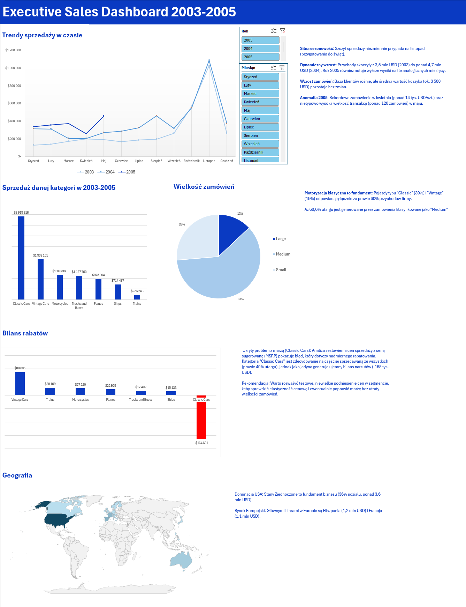

# Dashboard Sprzedażowy dla Kadry Kierowniczej (2003-2005) 

## Opis Projektu
Ten projekt to interaktywny dashboard w programie Excel, stworzony do analizy historii danych sprzedażowych, odkrywania trendów przychodów oraz identyfikacji nieefektywności w strategiach cenowych. Celem było przekształcenie surowych danych o sprzedaży w konkretne wnioski biznesowe i rekomendacje.

*(Uwaga: Interaktywny plik `.xlsx` z tabelami i modelem danych znajduje się w repozytorium).*

## Wnioski Biznesowe i Rekomendacje 

Dzięki eksploracji danych i analizie z użyciem tabel przestawnych zidentyfikowałem kilka kluczowych czynników wpływających na wynik firmy:

1. **Błąd strategii cenowej (Wyciek marży):** Odkryłem znaczący problem z flagową linią produktów "Classic Cars". Mimo że generuje ona niemal 40% przychodów firmy, jest to *jedyna* kategoria, która notuje ujemny bilans narzutów/rabatów (-164 tys. USD względem ceny sugerowanej MSRP).
   * **Rekomendacja:** Zmniejszenie agresywnego rabatowania tej kategorii przy zamówieniach średniej wielkości ("Medium"), aby przetestować elastyczność cenową i odzyskać utraconą marżę.
2. **Silna sezonowość Q4:** Zarówno rok 2003, jak i 2004 wykazują potężne szczyty sprzedaży w listopadzie, co jest napędzane przygotowaniami do sezonu świątecznego.
3. **Globalny rozkład przychodów:** Rynek USA jest absolutnym fundamentem biznesu, odpowiadając za 36% całkowitego przychodu globalnego (3,6 mln USD). Kolejne kluczowe rynki to Hiszpania (1,2 mln USD) i Francja (1,1 mln USD).

## Wykorzystane Umiejętności Techniczne 🛠️
* **Oczyszczanie i Przygotowanie Danych:** Transformacja surowych danych `.csv` w ustrukturyzowane Tabele Excel.
* **Modelowanie Danych:** Budowa warstwy obliczeniowej za pomocą **Tabel Przestawnych**.
* **Wizualizacja Danych:** Tworzenie **Wykresów Przestawnych** (Liniowe, Paskowe, Kołowe, Mapa) z formowaniem warunkowym (podświetlenie wartości ujemnych).
* **Interaktywność:** Implementacja **Fragmentatorów (Slicerów)** połączonych z wieloma wykresami układu w celu dynamicznego filtrowania po roku i terytorium.
* **Storytelling Biznesowy:** Tłumaczenie surowych liczb na zwięzłe, gotowe do podjęcia akcji podsumowania biznesowe.

## Jak korzystać z projektu
1. Pobierz plik `Sales_Data_Analysis_Dashboard.xlsx` z tego repozytorium.
2. Otwórz w programie Excel.
3. Do dynamicznego filtrowania wskaźników użyj "Fragmentatorów" (przycisków do filtrowania) na arkuszu głównym.
